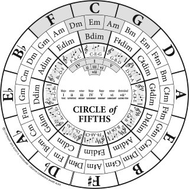

Chords
======

Chords and chord progressions are an essential part of the jazz tradition, and play a crucial role in shaping the overall
sound and feel of the music. In traditional New Orleans jazz, chords and chord progressions are used to create a rich and
harmonically complex sound, and are an important part of the musical language.

In this chapter, we will explore the various chords and chord progressions used in traditional New Orleans jazz, and how
they contribute to the overall sound and feel of the music. We will examine the role of different chord types, such as major,
minor, and diminished chords, and how they are used to create different moods and emotions in the music. We will also look at
how chord progressions are used to create tension and resolution, and how they contribute to the overall form and structure
of the music.

By understanding the role of chords and chord progressions in traditional New Orleans jazz, we can better appreciate the complexity
and depth of this exciting and vibrant musical style.

Progressions
------------

There is a great YouTube video describing several Jazz Chord Progressions [PIA2021]_.

.. youtube:: -4JR00GY3PA
    :width: 100%

It names these progressions:

* Turnaround Progression: ``I - VI - II - V``
* Cycle of 5ths: ``VI - II - V - I - IV - VII - III``
* Extended Turnaround Progression: ``I - IV - III - VI - II - V - I``
* Minor Turnaround Progression: ``Im7 - VIm7b5 - IIm7b5 - V7``
* Sentimental Progression: ``Im - Im/7 - Im/b7 - 1m/6``
* Misty Progression: ``II-V-I``
* Chromatic Walkup: ``I - #Idim7 - IIm7 - #IIdim7``
* Blues Progression ``I - IV - I - I - IV - IV - I - I - V - IV - I - V``

.. index::
   single: Tonic
   single: Dominant
   single: Subdominant

Harmonic functions
------------------

In music, a harmonic function refers to the role that a chord plays in the progression of a piece of music. Harmonic functions
help to define the tonality and structure of a piece of music, and they can affect the way that the music is perceived by the listener.

There are several different types of harmonic functions, including tonic, dominant, and subdominant.

- *Tonic*: The tonic is the root chord of the key and represents the home or resting point of the music.
  It is typically played at the beginning and the end of a piece of music, and it gives a sense of resolution and closure.
- *Dominant*: The dominant is the chord a fifth above the tonic, and it creates tension and a sense of movement in the music.
  It often leads to the tonic, helping to create a sense of resolution.
- *Subdominant*: The subdominant is the chord a fifth below the tonic, and it also creates tension and a sense of movement in the music.
  It often leads to the dominant, helping to build tension and create a sense of resolution.

These are the three main harmonic functions in Western music, and they are often used in combination to create a sense of structure and
tonality in a piece of music. Other harmonic functions, such as the relative minor or the submediant, may also be used to create variety and add complexity to the music.

Overall, harmonic functions are an important aspect of music theory and play a key role in the structure and tonality of a piece of music.
They help to define the relationships between different chords and create a sense of movement and resolution in the music.

See [HUT2017]_ for more information.

.. index::
   single: Circle of Fifths

Circle of fifths
----------------

The circle of fifths is a visual representation of the relationships between the 12 tones of the chromatic scale and the key signatures used in Western music.
It is called the "circle of fifths" because it arranges the key signatures in a circular fashion, with each key signature a perfect fifth away from the next.

The circle of fifths can be used to understand the relationships between different keys and to easily move between them. Starting from the top of the circle
and moving clockwise, each key signature is a perfect fifth higher than the one before it. For example, the key of C is a perfect fifth higher than the key
of F, and the key of G is a perfect fifth higher than the key of C.

Conversely, moving counterclockwise around the circle of fifths, each key signature is a perfect fifth lower than the one before it. For example, the key of
F is a perfect fifth lower than the key of C, and the key of B♭ is a perfect fifth lower than the key of F.

The circle of fifths is an important tool for musicians and music theorists, as it helps to understand the relationships between different keys and the
intervals between them. It is also useful for transposing music, or moving it to a different key, as it shows the relationships between the different keys
and the number of sharps or flats in each key signature.

However there is more use as described by [FOR2022]_.

References
----------

.. [PIA2021] Piano With Jonny. (2021, January 29). How I Can Play Hundreds of Jazz Songs from Memory [Video]. YouTube. https://www.youtube.com/watch?v=-4JR00GY3PA
.. [HUT2017] Hutchinson, R. (2017) Harmonic Function, Music theory for the 21st-century classroom. Available at: https://musictheory.pugetsound.edu/mt21c/HarmonicFunction.html (Accessed: December 29, 2022).
.. [FOR2022] Forrest (2022) The circle of fifths - music theory basics, Jazzadvice. jazzadvice.com. Available at: https://www.jazzadvice.com/lessons/music-theory-basics-circle-of-fifths/ (Accessed: December 29, 2022).